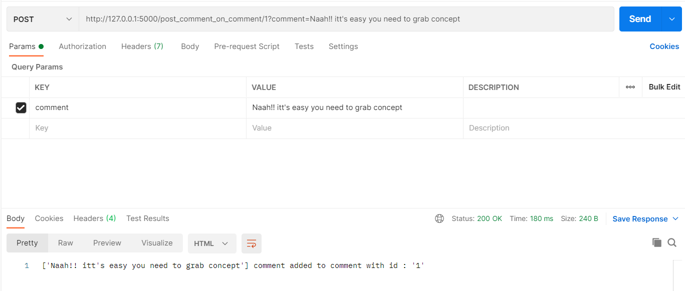

# Evolv-Assignment
Application on CRUD operation on blog. (Backend)

to run the app there are 2 ways :

1. Clone the repo in a folder

   Run on VS code
   
   Install required packages using VS code terminal with commands :
   
    pip install flask
    
    pip install flask-restfull
    
   then, run code
   
2. Clone the repo in a folder

   Run on cmd
   
   Use cd to go to the folder where cloned folder is placed
   
   Create virtual enviorment using commands:
   
      "python -m venv venv"
      
   Activate virtual enviorment using :
   
      "venv/scripts/activate"
      
   Now set the flask_app :
   
      "set FLASK_APP = app.py"
      
   Now, use "flask run"
   
After running the app on : http://127.0.0.1:5000/

Open postman and create new workspae named : "My Workspace"

open workspace and tap "create a request"

Then, enter " http://127.0.0.1:5000/ " on "Enter Request URL" with "GET" method to create databases

Now, enter the links in the "Enter Request URL" and choose method accordingly as shown in figure.

LEVEL 1

  • POST : Add a blog (Request URL :- http://127.0.0.1:5000/add_blog)
  
    Enter Values of variables ( author_name , blog_title , blog_content) as shown in figure.
    
    
  
  
  
  • GET : Get all the blogs (Request URL :- http://127.0.0.1:5000/display_blog)
  
  
  
  
  
  • GET : Get a blog by id (Request URL :- http://127.0.0.1:5000/display_blog_by_id/2)
  
  
  
  
  
  • PUT : Update the blog with given id. (Request URL :- http://127.0.0.1:5000/update_blog/1 )
  
    Enter Values of variables ( author_name , blog_title , blog_content) as shown in figure.
    
    
  
  
  
  • DELETE : Delete a blog with given id (Request URL :- http://127.0.0.1:5000/delete_blog/1)
  
  
  
  
  
LEVEL 2

  • POST : Post a comment on post (Request URL :- http://127.0.0.1:5000/post_comment)
  
    Enter Values of variables ( blog_id , comment) as shown in figure.
    
    
  
  
  
  • GET : Get all comment for a post (Request URL :- http://127.0.0.1:5000/get_comment/2)
  
  
  

LEVEL 3
  • POST : Comment on a comment (Request URL :- http://127.0.0.1:5000/post_comment)

  

  • GET : Get all comment for a comment (Request URL :- http://127.0.0.1:5000/post_comment)

  
  

• Exception Handling : Done in the program itself.
